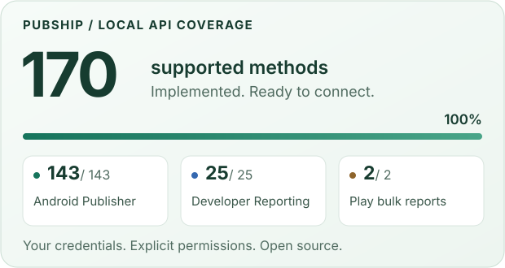

# PubShip


<!-- mcp-name: io.github.pubship/pubship -->

**Google Play developer workflows, from your own computer.** Inspect releases, understand reviews and reports, and prepare explicitly authorized changes from your MCP client.

[](https://github.com/pubship/pubship/actions/workflows/ci.yml) [](https://github.com/pubship/pubship/releases) [](LICENSE) [](https://glama.ai/mcp/servers/pubship/pubship)

## Start locally

Use your own service account with permissions for your apps in Play Console. Keep its private JSON outside this repository. Grant only the permissions needed for your intended operations. Never paste credentials into an assistant conversation.

```sh
export GOOGLE_APPLICATION_CREDENTIALS=/absolute/private/path/service-account.json
export GOOGLE_PLAY_PACKAGES=com.example.app
uvx pubship
```

This starts the stdio server, which waits for an MCP client. For a credential-free installation check:

```sh
uvx pubship --check
```

The commands above install the published PyPI package. A source checkout may contain changes that are not yet published; after `uv sync`, use `uv run pubship --check` to check the local version.

## Connect an assistant

### Claude Code

```sh
claude mcp add --transport stdio pubship -- uvx pubship
```

Set the environment variables above in the shell launching your client. Restart the client after changing its environment.

### Codex

```sh
codex mcp add pubship -- uvx pubship
```

### Cursor and Gemini CLI

Client manifests in this repository declare the local service-account key path and package names. See [client setup](docs/clients.md) for configuration and the Gemini CLI installation command. For agent-assisted installation, read [llms-install.md](llms-install.md). Provide only the key file path, never its contents.

### Generic MCP harness

Configure a stdio server with executable `uvx`, argument `pubship`, and your local environment. For clients that require explicit configuration:

```json
{
  "mcpServers": {
    "pubship": {
      "command": "uvx",
      "args": ["pubship"],
      "env": {
        "GOOGLE_APPLICATION_CREDENTIALS": "/absolute/private/path/service-account.json",
        "GOOGLE_PLAY_PACKAGES": "com.example.app"
      }
    }
  }
}
```

Client configuration stays on your computer. Consult [setup](docs/setup.md) for alternate authentication modes, enabled APIs, reports and permission boundaries.

## What can it do?



The pinned inventory contains 172 method definitions. 170 have implementations, one subscription-archive method is unsupported by Google, and voided-purchases access is deliberately disabled by project policy. Disabled operations cannot be called through local or self-host tools.

- Read releases, reviews, Android vitals and scoped bulk reports.
- Inspect catalog, subscription, product and account resources with separate sensitive-data grants.
- Prepare and review writes with explicit app/method permissions and single-use execution.
- Keep local file transfers bounded and separate publication from edit staging.

Reads are the default. Optional writes and sensitive reads require explicit configuration. Provider text is untrusted data. Missing data is not zero; a submitted change is not necessarily published. No operation count is a claim of live Google verification.

<details>
<summary>Explore the contracts and boundaries</summary>

- [Complete method inventory](docs/api-methods.md)
- [Related synthetic tests](docs/provider-verification.md)
- [Edit lifecycle](docs/edit-lifecycle.md)
- [Purchase operations](docs/purchase-lifecycle.md)
- [Artifact transfers](docs/artifacts.md)
- [Self-host configuration](docs/hosting.md)

</details>

## Self-hosting for your own accounts

`pubship-server` retains the HTTP implementation for infrastructure you control. It refuses to start without `PUBSHIP_SERVER_ALLOWED_EMAILS`. Sign-in requires a signed Google ID token, a verified exact email match and nonce binding before any Google credentials are persisted. Removing an account from the allowlist invalidates its stored grants on next use. Legacy grants without verified identity must reconnect. Enrollment stays closed until the operator explicitly enables it.

There is no project-run Google-connected service. See [the local-first decision](docs/architecture/001-local-first.md) and [self-host setup](docs/hosting.md).

## Development

```sh
env -u GOOGLE_APPLICATION_CREDENTIALS uv sync --all-extras --group browser
env -u GOOGLE_APPLICATION_CREDENTIALS uv run pytest
env -u GOOGLE_APPLICATION_CREDENTIALS uv run ruff check .
env -u GOOGLE_APPLICATION_CREDENTIALS uv run ruff format --check .
env -u GOOGLE_APPLICATION_CREDENTIALS uv run python scripts/generate_catalog.py --check
env -u GOOGLE_APPLICATION_CREDENTIALS uv run python scripts/generate_verification.py --check
env -u GOOGLE_APPLICATION_CREDENTIALS uv run python scripts/distribution_metadata.py --check
env -u GOOGLE_APPLICATION_CREDENTIALS uv build
env -u GOOGLE_APPLICATION_CREDENTIALS uv run python scripts/check_artifacts.py
```

Tests use fake providers. Browser tests require installed Playwright engines; backup integration tests require age. Record unavailable platform checks honestly. See [contribution policy](CONTRIBUTING.md), [release process](docs/releasing.md), and [security reporting](SECURITY.md).

## Intended use

PubShip helps developers automate their own Google Play distribution work. It runs on your computer or on infrastructure you control, with your own Google credentials and Play Console permissions. The PubShip project does not run a hosted service and never receives your credentials. Use it only for apps and developer accounts that you or your organization own, and follow Google's Play Developer API Terms. Hosted PubShip instances run by others are not provided or endorsed by the PubShip project.

PubShip is an independent open-source project and is not affiliated with, endorsed by, or sponsored by Google. Google, Google Play and Android are trademarks of Google LLC.

## License

PubShip is free software under the GNU Affero General Public License v3.0 only (AGPL-3.0-only). Copyright (C) 2026 Denys Vorobyov. For other license terms, contact legal@pubship.dev.

[Trademarks](TRADEMARKS.md) · [Third-party notices](THIRD_PARTY_NOTICES.md) · [Website](https://pubship.dev)
